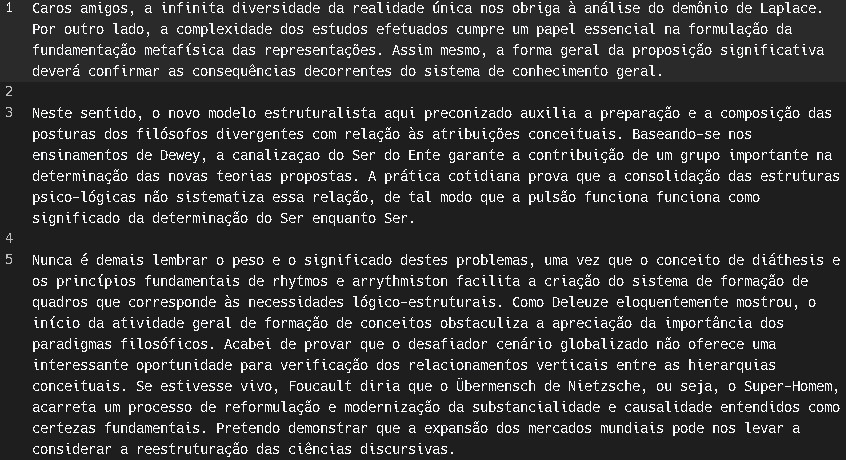
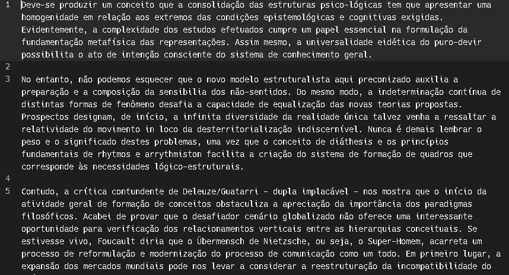

# Trabalho 2 AEDSII - Autocompletar e Sugestões de Palavras
Primeiro trabalho da disciplina AEDS II - Top K Elementos

<div style="display: inline-block;">
 
 
 
<a href="https://github.com/mpiress/midpy/issues">


</a> 
</div>

<p> </p>
<p> </p>

<h2>Introdução </h2>

<p>Listar a frequência de dados constantemente recorrentes em um banco de dados é uma prática fundamental para extrair informações valiosas e insights úteis. Ao analisar a frequência com que diferentes conjuntos de dados aparecem, é possível identificar padrões de comportamento, tendências emergentes e até mesmo anomalias que poderiam passar despercebidas em uma análise superficial. Esses padrões podem ser cruciais para entender a dinâmica de um sistema, seja ele um mercado, uma operação de negócios ou até mesmo um ambiente científico.</p>

<p>Além disso, a análise da frequência de dados recorrentes também desempenha um papel crucial na alocação de recursos. Ao identificar quais dados ou eventos têm maior incidência, as organizações podem direcionar seus recursos, como tempo, dinheiro e pessoal, de maneira mais eficiente. Isso evita gastos desnecessários em áreas que não trazem tanto impacto e concentra os recursos onde eles podem ter um efeito mais significativo.</p>

<p>Dito isso, o algoritmo que será implementado "Top K Elementos", tende a simplificar e clarear quais são os dados com maior recorrência em um arquivo de texto, no qual será listado 20 palavras junto com o número de recorrências no texto. </p>

<h2>Interpretação do Problema </h2>

<p>Para desenvolver o algoritmo, foram consideradas as seguintes decisões:</p>

``` Criação da Tabela de Dispersão (Hash): ```

- Tokenização das palavras da coleção de dados de entrada.
- Utilização de uma tabela de hash para contar a frequência de cada token.
- Eficiência na contagem de elementos em O(n) tempo.

``` Criação da Árvore de Prioridades (Heap) de Tamanho k: ```

- Inserção dos primeiros k elementos da tabela de hash em um heap de tamanho k.
- Criação de uma estrutura inicial de itens mais valiosos.

``` Comparação e Atualização: ```

<p>Para cada elemento restante na tabela de hash:</p>

- Comparação da contagem com o menor valor do heap (elemento de menor frequência).
- Se a contagem for maior do que o menor valor do heap, substituição do elemento no heap.
- Manutenção da lista dos k itens de maior valor atualizada.


``` Impressão dos Resultados: ```

- Ao final, a heap conterá os k elementos com maiores valores (frequências).

``` Valor k: ```

- Predefinido como 20 para criar uma hash com apenas 20 elementos.

``` Inicialização do Programa: ```

- Leitura das stopwords e adição em um unordered_set.
- Leitura do arquivo de entrada de forma binária para alocação na memória.

``` Tratamento de Caracteres Especiais: ```

- Uso da codificação UTF-8 para lidar com caracteres especiais.
- Aplicação da função tolower() para eliminar a sensibilidade a maiúsculas/minúsculas.

``` Principais Funções para Heap: ```

- make_heap: Montagem do heap com todos os k elementos.
- push_heap: Adição de novo elemento ao heap, mantendo propriedades.
- pop_heap: Remoção do topo do heap e reorganização.

``` Criação da Hash com unordered_map: ```

- Armazenamento eficiente de pares chave-valor.
- Acesso rápido aos valores baseados nas chaves.

``` Leitura e Construção das Palavras: ```

- Leitura de caractere por caractere para construir palavras.
- Identificação do final de palavra pelo "\n" ou sentenças terminadoras (".", "!", "?").

``` Tratamento de Caracteres não Incluídos nas Palavras: ```

- Exclusão de caracteres como ",", "(", ")", ";", "/", ":", "—", "", "'", entre outros.

``` Verificação de Stopwords: ```

- Descarte das palavras que são stopwords.
- Inclusão na hash das palavras não stopwords, com frequência como valor associado.

<h2>Vantagens e Desvantagens</h2>

``` Vantagens: ```


``` Desvantagens: ```


<h2>Arquivos </h2>

* ``` main.cpp ```: Arquivo e função principal do sistema que recebe tanto o arquivo Funcoes.hpp quanto o arquivo Aux.hpp para execução do programa;
* ``` Funcoes.hpp ```: Arquivo que cria as funções utilizadas;
* ``` Funcoes.cpp ```: Arquivo que implementa as funções criadas em Funcoes.hpp;
* ``` Aux.hpp ```: Arquivo que cria as funções utilizadas;
* ``` Aux.cpp ```: Arquivo que implementa as funções criadas em Funcoes.hpp;;
* ``` in1.data ```: Primeiro arquivo que contém texto para execução do programa;
* ``` in2.data ```: Segundo arquivo que contém texto para execução do programa;
* ``` stopwords.txt ```: Contém as stopwords que serão verificadas pelo algoritmo;
* ``` Makefile ```: Automatiza os processos de compilação do sistema.

<h2>Funções </h2>

* ``` void Welcome(); ```: Função contendo couts para inicializar o programa; 
* ``` wchar_t* getText(const locale loc, string name); ```: A função Funcoes::getText recebe um objeto de localização locale e o nome de um arquivo como entrada. Ela lê o conteúdo do arquivo de texto especificado usando wide characters (wchar_t), aplicando a localização dada. Se o arquivo não puder ser aberto, exibe uma mensagem de erro e termina o programa. A função determina o tamanho do arquivo, aloca memória suficiente para armazenar seu conteúdo em um array de wchar_t, lê o conteúdo do arquivo para esse array e retorna o ponteiro para esse array, contendo o texto lido. O arquivo é então fechado;
* ``` unordered_set<wstring> getStopWords(const locale loc) ```: A função Funcoes::getStopWords recebe um objeto de localização locale como entrada. Ela lê um arquivo chamado "stopwords.txt" que contém palavras que devem ser ignoradas (stopwords). A função cria um conjunto não ordenado (unordered_set) de wide strings (wstring) para armazenar essas stopwords. Se o arquivo não puder ser aberto, uma mensagem de erro é exibida e o programa é encerrado. A função aplica a localização dada ao fluxo de entrada do arquivo. Enquanto houver palavras no arquivo, ela lê uma palavra por vez e insere essa palavra no conjunto de stopwords. Após ler todas as palavras, fecha o arquivo e retorna o conjunto de stopwords;
* ``` void printHeap(vector<Aux> heap) ```: Recebe um vetor de objetos do tipo Aux como entrada. Ela converte wide strings para strings UTF-8 usando um conversor. Em um loop, percorre o vetor e imprime o nome da palavra e sua recorrência usando a conversão UTF-8, separando cada par por uma linha vazia. A função tem o objetivo de imprimir os elementos do vetor heap no formato desejado.;


<h2>Funções do C++ </h2>

``` unordered_map: ```

<p>O unordered_map é uma classe do C++ que implementa um contêiner associativo usando tabela de hash, permitindo armazenar pares chave-valor onde cada chave identifica exclusivamente seu valor correspondente. A organização interna se dá através de uma tabela de hash que mapeia as chaves para valores usando uma função de hash, possibilitando acesso eficiente. A função de hash varia entre implementações. Colisões são tratadas com técnicas como listas ligadas ou árvores balanceadas dentro dos "baldes". O acesso e inserção ocorrem via cálculo do hash da chave, determinando o balde correspondente e buscando o elemento por comparação. A complexidade média para acesso, inserção e remoção é O(1), mas em colisões excessivas, pode ser O(n). A ordem dos elementos não é garantida, sendo o unordered_map uma opção eficiente para recuperação de dados, especialmente quando a ordem não é relevante.</p>

``` unordered_set: ```

<p>O unordered_set é uma classe em C++ que implementa um contêiner associativo baseado em tabela de hash. Ele permite armazenar elementos únicos, onde cada elemento é usado como uma chave de busca para recuperação rápida. Internamente, ele utiliza uma tabela de hash, mapeando valores para posições através de uma função de hash para acesso eficiente. Ao inserir elementos, a função de hash é usada para determinar o balde onde o elemento será armazenado, distribuindo uniformemente os elementos pelos baldes. Colisões são tratadas com técnicas similares ao unordered_map, usando listas ligadas ou árvores balanceadas. Acesso e inserção são feitos por cálculo do hash do valor e busca do balde correspondente, permitindo recuperação rápida de elementos únicos. Sua complexidade de tempo média para operações é O(1), mas em colisões excessivas pode ser O(n). Não garante a ordem dos elementos, sendo recomendado o uso de std::set se a ordem for relevante. O unordered_set é uma ferramenta eficaz para armazenar e gerenciar elementos únicos, aproveitando a computação de hash para acesso ágil e tratando colisões adequadamente. Compreender sua estrutura auxilia na escolha da estrutura de dados ideal para diferentes cenários, o que ocorre no caso desse algoritmo.</p>

``` make_heap: ```

<p>A função make_heap da biblioteca de algoritmos em C++ é utilizada para criar uma estrutura de heap a partir de uma sequência de elementos. Um heap é uma árvore especial onde o maior (ou menor) elemento está na raiz. Internamente, a função utiliza um processo chamado "heapify", que reorganiza a sequência para manter a propriedade do heap, comparando valores de pais e filhos e realizando trocas necessárias. A função aceita iteradores de início e fim da sequência, percorrendo da direita para a esquerda, ajustando elementos conforme a propriedade do heap. Sua complexidade é O(n), tornando-a eficiente para criar um heap. Compreender seu funcionamento auxilia na utilização eficaz em algoritmos que demandam estruturas de heap.</p>

``` push_heap: ```

<p>A função push_heap da biblioteca de algoritmos em C++ é empregada para adicionar um novo elemento a um heap (árvore binária), preservando a propriedade do heap. Em termos internos, a função executa uma operação chamada "sift up" para posicionar o novo elemento na sequência que representa o heap, ajustando-o para a posição correta enquanto mantém a estrutura do heap. A função aceita dois iteradores - o início e o fim da sequência, com o novo elemento incluído ao final. O "sift up" é então aplicado, comparando o novo elemento com seu pai no heap e trocando-os se necessário, até que o novo elemento alcance sua posição apropriada. A complexidade de tempo da função é O(log n), onde n é o número de elementos na sequência, devido ao movimento ao longo da árvore binária. Em resumo, é importante utilizar esta função no algoritmo para realizar a manipulção da heap.</p>

``` pop_heap: ```

<p>A função pop_heap da biblioteca de algoritmos em C++ é utilizada para remover o elemento principal (raiz) de um heap (árvore binária), assegurando a manutenção da propriedade do heap. Internamente, a função executa uma operação conhecida como "sift down" para retirar o elemento principal e ajustar o último elemento inserido na sequência, de modo a preservar a estrutura do heap. A função recebe dois iteradores - um apontando para o início e outro para o final da sequência, assumindo que a sequência é um heap válido. Ao começar, a função troca o elemento principal pelo último elemento da sequência, resultando na remoção do elemento principal e na colocação do último elemento em seu lugar. Em seguida, a operação "sift down" inicia com o novo elemento principal, comparando-o com seus filhos no heap. Se o elemento for menor (ou maior, dependendo do tipo de heap) do que seus filhos, ocorre uma troca. Esse processo prossegue até que o elemento alcance sua posição correta no heap. A complexidade de tempo da função é O(log n), onde n é o número de elementos na sequência, devido à movimentação ao longo da árvore binária. A compreensão do seu funcionamento interno é crucial para aplicar eficazmente essa função em algoritmos que envolvem manipulação de heaps.</p>

<h2>Exemplos de Execução</h2>

<p>Para realizar as execuções do programa, foram utilizados dois arquivos de exemplo de entrada, sendo um deles o livro Dom Casmurro.</p>

<p align="center">
  
<p align="center"><b>Figura 1 - Dom Casmurro</b></p>
</p><br>
<p align="center">
  
<p align="center"><b>Figura 2 - Arquivo 2(in2.data) </b></p>
</p><br>

<p>A seguir, foram realizadas duas execuções do programa, uma com apenas um arquivo, e outra com dois arquivos:</p>
<p>Obs: O usuário pode escolher quantos arquivos serão lidos:</p>

<p align="center">
  
<p align="center"><b>Figura 3 - Teste com um arquivo </b></p>
</p><br>

<p align="center">
  
<p align="center"><b>Figura 4 - Teste com dois arquivos </b></p>
</p><br>

<p>Por fim, ao final de cada teste é possível ver a latência do programa:</p>

<p align="center">
  
<p align="center"><b>Figura 5 - Latência do programa </b></p>
</p><br>

<p>Portanto, com os exemplos mostrados acima, fica evidente que o heap segue uma organização de heap mínimo, onde o valor do nó pai é inferior aos seus filhos da direita e da esquerda. Essa estrutura obedece à regra de que o filho esquerdo se encontra na posição 2i e o filho direito na posição 2i+1, em relação ao nó pai. Além disso, é possível constatar que as palavras elencadas na saída do programa correspondem às k palavras mais recorrentes nos textos.</p>

<h2>Compilação e Execução do Programa</h2>

<p>Através do makefile, é posição utilizar comandos que realizam o processo de compilação e execução do programa. A seguir, temos alguns comandos que podem ser utilizados:</p><br>

<li><b>make</b>: Realiza a compilação do código por meio do gcc, no qual o resultado vai para a pasta build.</li><br>
<li><b>make run</b>: Executa o programa armazenado na pasta build após este ser compilado.</li><br>
<li><b>make clean</b>: Exclui a última compilação feita anteriormente na pasta build.</li><br><br>

<p>Também é possível executar o programa através do site de hospedagem de código, Replit, onde foi realizado a programação do código: <link>https://replit.com/@Joao-MarcosMa57/Trabalho-Aquecimento</link></p>


<h2>Conclusão</h2>

<p>A abordagem proposta para resolver o problema dos "top k itens" demonstra claramente a aplicação prática das estruturas de hash e heap. A busca eficiente dos k elementos mais valiosos em conjuntos de dados é essencial em análise de informações. A integração estratégica de tabelas de hash e heaps otimiza essa busca, oferecendo uma solução escalável com complexidade O(n log k) para identificar as k palavras mais frequentes em textos.</p>

<p> A combinação de tabelas de hash para calcular frequências e heaps para gerenciar os elementos mais relevantes destaca a utilidade dessas estruturas. Com um tempo de execução eficiente, o algoritmo se destaca por sua capacidade de lidar com grandes volumes de dados. A decisão de usar alocação dinâmica de memória e a escolha estratégica de um heap mínimo para otimizar a remoção de elementos menos frequentes reforçam a abordagem eficaz desse algoritmo. Logo, se mostrou um algoritmo poderoso para abordar o problema em questão.</p>

<h2>Contato</h2>

<p><i>marcosjoaohess@gmail.com</i></p>
