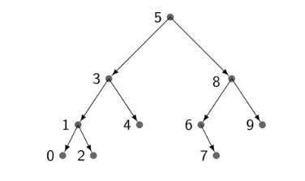
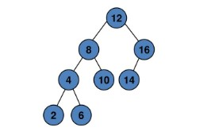
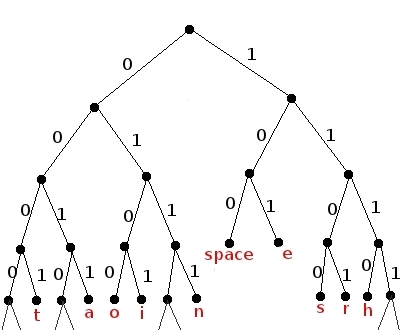

# Trabalho 2 AEDSII - Autocompletar e Sugestões de Palavras
Segundo trabalho da disciplina AEDS II 

<div style="display: inline-block;">
 
 
 
<a href="https://github.com/mpiress/midpy/issues">


</a> 
</div>

<p> </p>
<p> </p>

<h2>Introdução </h2>

<p>A inclusão de um sistema de autocompletar e sugestões de palavras em um programa ou aplicativo é fundamental para melhorar a experiência do usuário, reduzir erros de digitação, aumentar a produtividade, aprimorar a acessibilidade e oferecer sugestões personalizadas. Além disso, essa funcionalidade possibilita a economia tempo, melhoria da consistência dos dados e otimização da comunicação com servidores remotos, tornando-se uma característica valiosa em uma ampla gama de contextos de uso, desde aplicativos de produtividade até motores de busca e redes sociais.</p>

<p>O projeto utiliza uma estrutura de árvore binária como base central e implementa uma árvore AVL e o algoritmo de Huffman para análises de desempenho. Essas implementações adicionais permitem comparações detalhadas entre diferentes estruturas e algoritmos, a fim de entender seu impacto na eficiência e eficácia do sistema. Portanto, objetivo principal do algoritmo "Sistema de Autocompletar e Sugestões de Palavras" é melhorar a capacidade de oferecer recomendações e sugestões relevantes aos usuários, aprimorando a experiência de pesquisa e autocompletar com base na frequência de ocorrência das palavras nos textos e nas palavras que os usuários estão buscando.</p>

<h2>Interpretação do Problema </h2>

<p>Para desenvolver o algoritmo, foram consideradas as seguintes decisões:</p>

``` Criação da Tabela de Dispersão (Hash): ```

- Tokenização das palavras da coleção de dados de entrada.
- Utilização de uma tabela de hash para contar a frequência de cada token.
- Eficiência na contagem de elementos em O(n) tempo.

``` Criação da Árvore de Prioridades (Heap) de Tamanho k: ```

- Inserção dos primeiros k elementos da tabela de hash em um heap de tamanho k.
- Criação de uma estrutura inicial de itens mais valiosos.

``` Comparação e Atualização: ```

<p>Para cada elemento restante na tabela de hash:</p>

- Comparação da contagem com o menor valor do heap (elemento de menor frequência).
- Se a contagem for maior do que o menor valor do heap, substituição do elemento no heap.
- Manutenção da lista dos k itens de maior valor atualizada.


``` Impressão dos Resultados: ```

- Ao final, a heap conterá os k elementos com maiores valores (frequências).

``` Valor k: ```

- Predefinido como 20 para criar uma hash com apenas 20 elementos.

``` Inicialização do Programa: ```

- Leitura das stopwords e adição em um unordered_set.
- Leitura do arquivo de entrada de forma binária para alocação na memória.

``` Tratamento de Caracteres Especiais: ```

- Uso da codificação UTF-8 para lidar com caracteres especiais.
- Aplicação da função tolower() para eliminar a sensibilidade a maiúsculas/minúsculas.

``` Principais Funções para Heap: ```

- make_heap: Montagem do heap com todos os k elementos.
- push_heap: Adição de novo elemento ao heap, mantendo propriedades.
- pop_heap: Remoção do topo do heap e reorganização.

``` Criação da Hash com unordered_map: ```

- Armazenamento eficiente de pares chave-valor.
- Acesso rápido aos valores baseados nas chaves.

``` Leitura e Construção das Palavras: ```

- Leitura de caractere por caractere para construir palavras.
- Identificação do final de palavra pelo "\n" ou sentenças terminadoras (".", "!", "?").

``` Tratamento de Caracteres não Incluídos nas Palavras: ```

- Exclusão de caracteres como ",", "(", ")", ";", "/", ":", "—", "", "'", entre outros.

``` Verificação de Stopwords: ```

- Descarte das palavras que são stopwords.
- Inclusão na hash das palavras não stopwords, com frequência como valor associado.

``` Implementação das Árvores: ```

- Criação dos três tipos de árvores, sendo elas: Árvore Binária, Árvore AVL e Árvore de Huffman;
- Criação do árquivo output.txt para armazenar a palavra, o texto e a verificação dos testes em Pós-Ordem, Pré-Ordem e In-Ordem.

``` Observações: ```

<p>Para processar e armazenar as palavras dos arquivos, foi utilizado um método de alocação dinâmica em uma variável de caracteres, permitindo uma leitura rápida e eficiente dos dados em memória, especialmente adequado para arquivos menores que cabem facilmente na memória. No entanto, essa abordagem consome mais memória e pode ser ineficiente para arquivos muito grandes.</p>

<p>A leitura das stopwords e do arquivo input.data foi realizada diretamente a partir dos arquivos, sendo eficiente para grandes volumes de dados, evitando o consumo excessivo de memória. Entretanto, essa abordagem pode ser mais lenta devido às operações de leitura e escrita no arquivo. Foi escolhido usar hash e heap para otimizar o algoritmo, oferecendo eficiência na atualização durante a construção das árvores e a capacidade de preservar os heaps originais de cada texto. Essa escolha resulta em melhor desempenho, apesar do aumento no consumo de memória e complexidade da implementação. Para verificar a presença de palavras nos textos, tabelas de dispersão foram usadas para garantir eficiência na busca, proporcionando respostas rápidas, embora com um custo maior de memória. Em casos de colisão, a abordagem de inserção à esquerda foi adotada por sua simplicidade.</p>

<h1>Árvores Utilizadas</h1>

<h2>Árvore Binária </h2>

<p>Uma árvore binária é uma estrutura de dados hierárquica fundamental em ciência da computação, amplamente utilizada para organizar e armazenar dados de maneira eficiente. Ela é composta por nós interconectados em uma estrutura hierárquica, onde cada nó pode ter, no máximo, dois filhos: um filho à esquerda e um filho à direita. Essa estrutura é projetada de maneira a refletir uma relação de ordem entre os nós, onde o filho à esquerda representa um valor menor em relação ao nó pai, enquanto o filho à direita representa um valor maior. Isso torna as árvores binárias particularmente úteis para operações de busca, inserção e exclusão de dados, sendo um elemento central em algoritmos de ordenação, pesquisa e muitas outras aplicações computacionais.</p>

<p>Na implementação de uma árvore binária, pode-se optar por diferentes abordagens de inserção. No exemplo mencionado, foi escolhida a abordagem de inserção não recursiva, que envolve a iteração através dos nós da árvore até encontrar o local adequado para inserir um novo elemento. Em casos em que dois elementos possuem a mesma chave de ordenação, a opção foi inserir o novo elemento à esquerda do nó correspondente, mantendo assim a estrutura da árvore balanceada. Isso garante que a árvore permaneça ordenada e eficiente para operações de busca.</p>

<p>Abaixo, é apresentado um exemplo ilustrativo de uma árvore binária, destacando como os elementos estão organizados de acordo com a relação de ordem entre eles. Essa estrutura flexível e versátil é uma parte fundamental do repertório de estruturas de dados em ciência da computação e é amplamente aplicada em algoritmos e sistemas computacionais diversos.</p>

<p align="center">
  
<p align="center"><b>Figura 1 - Exemplo de Árvore Binária </b></p>
</p><br>


<h2>Árvore AVL(Árvore Adelson-Velsky e Landis)</h2>

<p>Uma Árvore AVL é uma estrutura de dados de árvore binária que mantém uma propriedade especial de balanceamento para garantir um desempenho eficiente em operações de busca, inserção e exclusão de dados. O balanceamento é alcançado através do uso de um fator de balanceamento em cada nó, que é a diferença entre as alturas das subárvores esquerda e direita. Aqui estão os principais pontos sobre a Árvore AVL:</p>

``` Inserção na Árvore AVL: ```

- A inserção em uma Árvore AVL é implementada de forma recursiva, semelhante à árvore binária padrão;
- Uma regra importante é que, quando um novo elemento é igual a um elemento já presente na árvore, o novo elemento é inserido à esquerda do nó correspondente.

``` Balanceamento da Árvore AVL: ```

- A árvore AVL mantém-se balanceada através do fator de balanceamento em cada nó;
- Se o fator de balanceamento de um nó for -1, 0 ou 1, a árvore é considerada balanceada;
- Se o fator de balanceamento de um nó for maior que 1, a árvore está desequilibrada à direita e requer rotações para reequilibrá-la;
- Se o fator de balanceamento de um nó for menor que -1, a árvore está desequilibrada à esquerda e também requer rotações para reequilibrá-la.

``` Balanceamento da Árvore AVL: ```

- Rotação Simples à Direita: Realizada quando um nó está desequilibrado à esquerda e o desequilíbrio ocorre na subárvore esquerda. Uma rotação simples à direita reequilibra a árvore;
- Rotação Simples à Esquerda: Realizada quando um nó está desequilibrado à direita e o desequilíbrio ocorre na subárvore direita. Uma rotação simples à esquerda reequilibra a árvore.
- Rotação Dupla à Direita: Realizada quando um nó está desequilibrado à esquerda e o desequilíbrio ocorre na subárvore direita. Envolve duas operações: primeiro, uma rotação à esquerda e, em seguida, uma rotação à direita.
- Rotação Dupla à Esquerda: Realizada quando um nó está desequilibrado à direita e o desequilíbrio ocorre na subárvore esquerda. Envolve duas operações: primeiro, uma rotação à direita e, em seguida, uma rotação à esquerda.

<p>O exemplo abaixo mostra, num geral, uma Árvore AVL típica após várias inserções e rotações, que pode ser visualizada como uma árvore binária bem balanceada, onde a diferença de altura entre as subárvores esquerda e direita de cada nó é sempre limitada a -1, 0 ou 1, mantendo assim a propriedade de balanceamento.</p>

<p align="center">
  
<p align="center"><b>Figura 2 - Exemplo de Árvore AVL </b></p>
</p><br>

<h2>Árvore de Huffman</h2>

<p>Uma árvore de Huffman é uma estrutura binária completa que se constrói de maneira incremental, juntando os dois símbolos menos frequentes e substituindo-os por símbolos auxiliares. Esse processo se repete até que todos os símbolos estejam agrupados, resultando em uma árvore binária completa. Em seguida, essa árvore é percorrida para atribuir valores binários (0 ou 1) às arestas, criando códigos binários exclusivos para cada símbolo.</p>

<p>Essa técnica de compactação é baseada na frequência dos símbolos no conjunto de dados. Os símbolos mais comuns recebem códigos mais curtos, enquanto os menos comuns recebem códigos mais longos. Isso resulta em uma compressão de dados altamente eficaz, onde a representação dos dados é otimizada, economizando espaço de armazenamento ou largura de banda em transmissões de dados.</p>

<p align="center">
  
<p align="center"><b>Figura 2 - Exemplo de Árvore de Huffman </b></p>
</p><br>

<h2>Arquivos </h2>

* ``` main.cpp ```: Arquivo e função principal do sistema que recebe tanto o arquivo Funcoes.hpp quanto o arquivo Aux.hpp para execução do programa;
* ``` Funcoes.hpp ```: Arquivo que cria as funções utilizadas como base do programa;
* ``` Funcoes.cpp ```: Arquivo que implementa as funções criadas em Funcoes.hpp;
* ``` AVLTree.hpp ```: Arquivo que cria as funções utilizadas para a implementação da árvore AVL;
* ``` AVLTree.cpp ```: Arquivo que implementa as funções criadas em AVLTree.hpp;
* ``` BinTree.hpp ```: Arquivo que cria as funções utilizadas para a implementação da árvore binária;
* ``` BinTree.cpp ```: Arquivo que implementa as funções criadas em BinTree.hpp;
* ``` HuffTree.hpp ```: Arquivo que cria as funções utilizadas para a implementação da árvore de Huffman;
* ``` HuffTree.cpp ```: Arquivo que implementa as funções criadas em HuffTree.hpp;
* ``` in1.data até in6.data```: Arquivos utilizados para testar o sistema;
* ``` stopwords.txt ```: Contém as stopwords que serão verificadas pelo algoritmo;
* ``` Makefile ```: Automatiza os processos de compilação do sistema.


<h2>Funções </h2>

* ``` void Welcome(); ```: Função contendo couts para inicializar o programa; 
* ``` wchar_t* getText(const locale loc, string name); ```: A função Funcoes::getText recebe um objeto de localização locale e o nome de um arquivo como entrada. Ela lê o conteúdo do arquivo de texto especificado usando wide characters (wchar_t), aplicando a localização dada. Se o arquivo não puder ser aberto, exibe uma mensagem de erro e termina o programa. A função determina o tamanho do arquivo, aloca memória suficiente para armazenar seu conteúdo em um array de wchar_t, lê o conteúdo do arquivo para esse array e retorna o ponteiro para esse array, contendo o texto lido. O arquivo é então fechado;
* ``` unordered_set<wstring> getStopWords(const locale loc) ```: A função Funcoes::getStopWords recebe um objeto de localização locale como entrada. Ela lê um arquivo chamado "stopwords.txt" que contém palavras que devem ser ignoradas (stopwords). A função cria um conjunto não ordenado (unordered_set) de wide strings (wstring) para armazenar essas stopwords. Se o arquivo não puder ser aberto, uma mensagem de erro é exibida e o programa é encerrado. A função aplica a localização dada ao fluxo de entrada do arquivo. Enquanto houver palavras no arquivo, ela lê uma palavra por vez e insere essa palavra no conjunto de stopwords. Após ler todas as palavras, fecha o arquivo e retorna o conjunto de stopwords;
* ``` void printHeap(vector<Aux> heap) ```: Recebe um vetor de objetos do tipo Aux como entrada. Ela converte wide strings para strings UTF-8 usando um conversor. Em um loop, percorre o vetor e imprime o nome da palavra e sua recorrência usando a conversão UTF-8, separando cada par por uma linha vazia. A função tem o objetivo de imprimir os elementos do vetor heap no formato desejado.;


<h2>Funções do C++ </h2>

``` unordered_map: ```

<p>O unordered_map é uma classe do C++ que implementa um contêiner associativo usando tabela de hash, permitindo armazenar pares chave-valor onde cada chave identifica exclusivamente seu valor correspondente. A organização interna se dá através de uma tabela de hash que mapeia as chaves para valores usando uma função de hash, possibilitando acesso eficiente. A função de hash varia entre implementações. Colisões são tratadas com técnicas como listas ligadas ou árvores balanceadas dentro dos "baldes". O acesso e inserção ocorrem via cálculo do hash da chave, determinando o balde correspondente e buscando o elemento por comparação. A complexidade média para acesso, inserção e remoção é O(1), mas em colisões excessivas, pode ser O(n). A ordem dos elementos não é garantida, sendo o unordered_map uma opção eficiente para recuperação de dados, especialmente quando a ordem não é relevante.</p>

``` unordered_set: ```

<p>O unordered_set é uma classe em C++ que implementa um contêiner associativo baseado em tabela de hash. Ele permite armazenar elementos únicos, onde cada elemento é usado como uma chave de busca para recuperação rápida. Internamente, ele utiliza uma tabela de hash, mapeando valores para posições através de uma função de hash para acesso eficiente. Ao inserir elementos, a função de hash é usada para determinar o balde onde o elemento será armazenado, distribuindo uniformemente os elementos pelos baldes. Colisões são tratadas com técnicas similares ao unordered_map, usando listas ligadas ou árvores balanceadas. Acesso e inserção são feitos por cálculo do hash do valor e busca do balde correspondente, permitindo recuperação rápida de elementos únicos. Sua complexidade de tempo média para operações é O(1), mas em colisões excessivas pode ser O(n). Não garante a ordem dos elementos, sendo recomendado o uso de std::set se a ordem for relevante. O unordered_set é uma ferramenta eficaz para armazenar e gerenciar elementos únicos, aproveitando a computação de hash para acesso ágil e tratando colisões adequadamente. Compreender sua estrutura auxilia na escolha da estrutura de dados ideal para diferentes cenários, o que ocorre no caso desse algoritmo.</p>

``` make_heap: ```

<p>A função make_heap da biblioteca de algoritmos em C++ é utilizada para criar uma estrutura de heap a partir de uma sequência de elementos. Um heap é uma árvore especial onde o maior (ou menor) elemento está na raiz. Internamente, a função utiliza um processo chamado "heapify", que reorganiza a sequência para manter a propriedade do heap, comparando valores de pais e filhos e realizando trocas necessárias. A função aceita iteradores de início e fim da sequência, percorrendo da direita para a esquerda, ajustando elementos conforme a propriedade do heap. Sua complexidade é O(n), tornando-a eficiente para criar um heap. Compreender seu funcionamento auxilia na utilização eficaz em algoritmos que demandam estruturas de heap.</p>

``` push_heap: ```

<p>A função push_heap da biblioteca de algoritmos em C++ é empregada para adicionar um novo elemento a um heap (árvore binária), preservando a propriedade do heap. Em termos internos, a função executa uma operação chamada "sift up" para posicionar o novo elemento na sequência que representa o heap, ajustando-o para a posição correta enquanto mantém a estrutura do heap. A função aceita dois iteradores - o início e o fim da sequência, com o novo elemento incluído ao final. O "sift up" é então aplicado, comparando o novo elemento com seu pai no heap e trocando-os se necessário, até que o novo elemento alcance sua posição apropriada. A complexidade de tempo da função é O(log n), onde n é o número de elementos na sequência, devido ao movimento ao longo da árvore binária. Em resumo, é importante utilizar esta função no algoritmo para realizar a manipulção da heap.</p>

``` pop_heap: ```

<p>A função pop_heap da biblioteca de algoritmos em C++ é utilizada para remover o elemento principal (raiz) de um heap (árvore binária), assegurando a manutenção da propriedade do heap. Internamente, a função executa uma operação conhecida como "sift down" para retirar o elemento principal e ajustar o último elemento inserido na sequência, de modo a preservar a estrutura do heap. A função recebe dois iteradores - um apontando para o início e outro para o final da sequência, assumindo que a sequência é um heap válido. Ao começar, a função troca o elemento principal pelo último elemento da sequência, resultando na remoção do elemento principal e na colocação do último elemento em seu lugar. Em seguida, a operação "sift down" inicia com o novo elemento principal, comparando-o com seus filhos no heap. Se o elemento for menor (ou maior, dependendo do tipo de heap) do que seus filhos, ocorre uma troca. Esse processo prossegue até que o elemento alcance sua posição correta no heap. A complexidade de tempo da função é O(log n), onde n é o número de elementos na sequência, devido à movimentação ao longo da árvore binária. A compreensão do seu funcionamento interno é crucial para aplicar eficazmente essa função em algoritmos que envolvem manipulação de heaps.</p>

<h2>Exemplos de Execução</h2>

<p>Para realizar as execuções do programa, foram utilizados dois arquivos de exemplo de entrada, sendo um deles o livro Dom Casmurro.</p>


<h2>Compilação e Execução do Programa</h2>

<p>Através do makefile, é posição utilizar comandos que realizam o processo de compilação e execução do programa. A seguir, temos alguns comandos que podem ser utilizados:</p><br>

<li><b>make</b>: Realiza a compilação do código por meio do gcc, no qual o resultado vai para a pasta build.</li><br>
<li><b>make run</b>: Executa o programa armazenado na pasta build após este ser compilado.</li><br>
<li><b>make clean</b>: Exclui a última compilação feita anteriormente na pasta build.</li><br><br>

<p>Também é possível executar o programa através do site de hospedagem de código, Replit, onde foi realizado a programação do código: <link>https://replit.com/@Joao-MarcosMa57/Trabalho-Aquecimento</link></p>


<h2>Conclusão</h2>


<h2>Contato</h2>

<p><i>marcosjoaohess@gmail.com</i></p>
